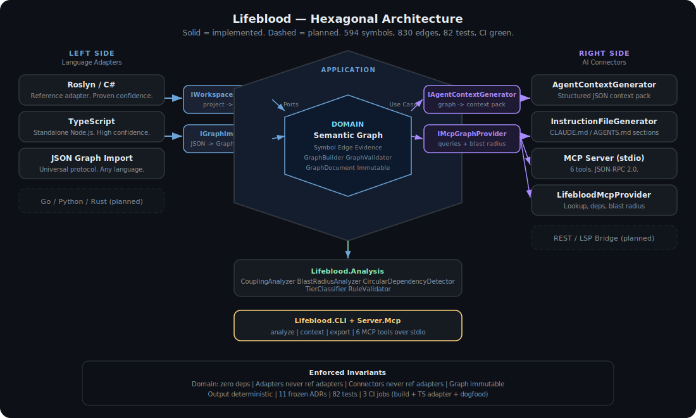

# Lifeblood

Compiler truth in, AI context out.

Lifeblood is a hexagonal framework that connects compiler-level code intelligence to AI tools. Language adapters on the left feed semantic data into a pure universal graph. AI connectors on the right consume that graph as structured context. The core normalizes everything in between.

```
Roslyn (C#)    ──┐                              ┌──  Context Pack (JSON)
JSON graph     ──┤  ┌────────────────────────┐  ├──  Instruction File (md)
               ──┼→ │    Semantic Graph      │ →┤──  MCP Graph Provider
  community    ──┤  │  (symbols · edges ·    │  ├──  CLI / CI
  adapters     ──┘  │   evidence · trust)    │  └──  (planned: MCP host,
                    └────────────────────────┘        REST, LSP)
```

We build the framework and one reference implementation (C# via Roslyn). The community builds the rest. Roslyn is open source. AI can help port adapter concepts to other languages. We provide the contracts, schemas, and golden repo test fixtures.

Born from shipping a [400k LOC Unity project](https://github.com/user-hash/LivingDocFramework/blob/main/docs/CASE_STUDY.md) with AI assistance and realizing that AI writes code but does not verify what it wrote.

---

## Why This Matters

AI builds backends but does not wire frontends. It adds methods but does not update callers. It refactors types but misses downstream consumers. It moves fast and never looks back.

That was fine when AI built simple prototypes. But AI-assisted projects are getting complex. At that scale, unverified code is a liability. The prototyping era is ending. The framework era is starting.

Lifeblood is built for that era. Point it at a codebase and get a verified semantic graph:

- Every edge points to a real symbol (no dangling references)
- Every symbol is reachable in the containment tree (no orphans)
- No duplicate edges, no missing evidence
- Every relationship carries proof of how it was discovered and how confident the adapter is

We dogfood Lifeblood on itself:

```
$ dotnet run --project src/Lifeblood.CLI -- analyze --project . --rules packs/lifeblood/rules.json
Symbols: 495
Edges:   661
Modules: 9
Types:   80
```

Zero violations. [Full dogfood findings](docs/DOGFOOD_FINDINGS.md)

---

## Quick Start

```bash
git clone https://github.com/user-hash/Lifeblood.git
cd Lifeblood
dotnet build
dotnet test
```

Analyze a C# project:

```bash
dotnet run --project src/Lifeblood.CLI -- analyze --project /path/to/your/project
dotnet run --project src/Lifeblood.CLI -- analyze --project /path/to/your/project --rules packs/hexagonal/rules.json
```

Generate an AI context pack (JSON):

```bash
dotnet run --project src/Lifeblood.CLI -- context --project /path/to/your/project
dotnet run --project src/Lifeblood.CLI -- context --project /path/to/your/project --format md
```

Export the semantic graph:

```bash
dotnet run --project src/Lifeblood.CLI -- export --project /path/to/your/project > graph.json
```

Analyze from any language via JSON:

```bash
your-parser ./project > graph.json
dotnet run --project src/Lifeblood.CLI -- analyze --graph graph.json --rules rules.json
```

---

## Architecture

```
Lifeblood.Domain                Pure graph model. Zero dependencies. The absolute core.
Lifeblood.Application           Ports and use cases. Depends only on Domain.
Lifeblood.Adapters.CSharp      Roslyn reference adapter. Left side.
Lifeblood.Adapters.JsonGraph    Universal JSON protocol adapter. Left side.
Lifeblood.Connectors.ContextPack  Context pack and instruction file generator. Right side.
Lifeblood.Connectors.Mcp       MCP graph provider. Right side.
Lifeblood.Analysis              Coupling, blast radius, cycles, tiers, rule validation.
Lifeblood.CLI                   Composition root. Wires left side to right side.
```

Domain never references Application. Application never references Adapters or Connectors. Adapters never reference other Adapters. Connectors never reference Adapters. All of this is enforced by [architecture invariant tests](tests/Lifeblood.Tests/ArchitectureInvariantTests.cs) and [9 frozen ADRs](docs/ARCHITECTURE_DECISIONS.md).



[Full architecture](docs/ARCHITECTURE.md) and [interactive diagram](docs/architecture.html)

---

## How Languages Plug In

**In-process C# adapter:** Implement `IWorkspaceAnalyzer` from `Lifeblood.Application.Ports.Left`. The Roslyn adapter is the reference implementation.

**External JSON adapter:** Write a parser in any language. Output JSON conforming to `schemas/graph.schema.json`. Lifeblood reads it via `JsonGraphImporter`. No C# needed.

**AI-assisted porting:** Roslyn is open source. The concepts (syntax trees, semantic models, symbol resolution) exist in every language toolchain. AI agents can help port adapter implementations. We provide the contracts and test fixtures.

See [docs/ADAPTERS.md](docs/ADAPTERS.md) for the full guide.

---

## What Comes Out

**Context Pack** produces structured JSON with high-value files, module boundaries, reading order, hotspots, dependency matrix, and active violations. Feed it to any AI tool.

**Instruction File Generator** analyzes a codebase and produces CLAUDE.md or AGENTS.md sections with architecture boundaries, dependency rules, and high-value files.

**MCP Graph Provider** serves symbol lookup, dependencies, dependants, and blast radius queries. The port interface is implemented. MCP server hosting over stdio/SSE is planned.

**CLI** runs analysis, validates architecture rules, generates context, and exports graphs. Designed for CI integration with exit codes.

---

## Status

Dogfood-verified. 80 tests. CI green.

| Assembly | State |
|----------|-------|
| Lifeblood.Domain | Implemented. GraphBuilder, GraphValidator, Evidence, ConfidenceLevel. |
| Lifeblood.Application | Implemented. All port interfaces, AnalyzeWorkspaceUseCase, GenerateContextUseCase. |
| Lifeblood.Adapters.CSharp | Implemented. Roslyn workspace analyzer, module discovery, symbol and edge extractors. |
| Lifeblood.Adapters.JsonGraph | Implemented. Import and export with round-trip fidelity. |
| Lifeblood.Connectors.ContextPack | Implemented. Context pack, instruction file, reading order generator. |
| Lifeblood.Connectors.Mcp | Implemented. Graph provider with blast radius delegation to analyzers. |
| Lifeblood.Analysis | Implemented. CouplingAnalyzer, BlastRadiusAnalyzer, CircularDependencyDetector, TierClassifier, RuleValidator. |
| Lifeblood.CLI | Implemented. analyze, context, export commands with rules support. |
| Lifeblood.Tests | 80 tests. Extractors, golden repos, round-trip, architecture invariants. |

**Rule packs:** [hexagonal](packs/hexagonal/rules.json), [clean-architecture](packs/clean-architecture/rules.json), [lifeblood](packs/lifeblood/rules.json) (self-validating)

**Planned:** MCP server hosting, TypeScript adapter, cross-module Roslyn resolution.

---

## Related

- [LivingDocFramework](https://github.com/user-hash/LivingDocFramework) — The methodology framework that shaped how Lifeblood is built
- [Roslyn](https://github.com/dotnet/roslyn) — The C# compiler platform
- [DAWG](https://dawgtools.org) | [itch.io](https://dawg-tools.itch.io/) — The 400k LOC project where we proved these ideas

## License

AGPL v3
