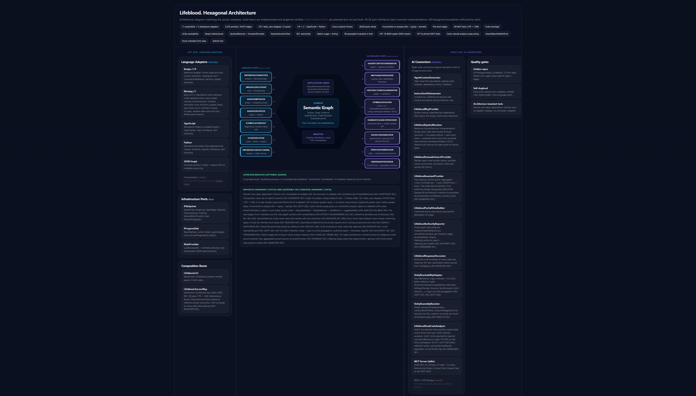

# Lifeblood

Compiler-as-a-service for AI agents.

Lifeblood gives AI agents direct access to what compilers know. Type resolution, call graphs, diagnostics, reference finding, code execution. All over a standard MCP connection. No IDE required. Load a project, ask the compiler, get verified answers. 
Compilers already know everything about your code, just pipe that truth to AI agents instead of letting them grep and guess.

```
Roslyn (C#)    ──┐                              ┌──  Execute code against project types
TypeScript     ──┤  ┌────────────────────────┐  ├──  Diagnose / compile-check
JSON graph     ──┼→ │    Semantic Graph      │ →┤──  Find references / rename / format
               ──┤  │  (symbols / edges /    │  ├──  Blast radius / file impact
  community    ──┘  │   evidence / trust)    │  └──  Context packs / architecture rules
  adapters          └────────────────────────┘
```

Born from shipping a [400k LOC Unity project](https://github.com/user-hash/LivingDocFramework/blob/main/docs/CASE_STUDY.md) with AI assistance and realizing that AI writes code but does not verify what it wrote.

---

## Quick Start

### Install (30 seconds)

```bash
dotnet tool install --global Lifeblood
dotnet tool install --global Lifeblood.Server.Mcp
```

Requires [.NET 8 SDK](https://dotnet.microsoft.com/download/dotnet/8.0).

### Connect to Claude Code, Cursor, or any MCP client

Add to your project's `.mcp.json`:

```json
{
  "mcpServers": {
    "lifeblood": {
      "command": "lifeblood-mcp",
      "args": []
    }
  }
}
```

See [MCP Setup Guide](docs/MCP_SETUP.md) for Claude Desktop, VS Code, Cursor, and raw stdio configs.

### Use

```
lifeblood_analyze projectPath="/path/to/your/project"   → load semantic graph
lifeblood_blast_radius symbolId="type:MyApp.AuthService" → what breaks if I change this?
lifeblood_file_impact filePath="src/AuthService.cs"      → what files are affected?
lifeblood_find_references symbolId="type:MyApp.IRepo"    → every caller, every consumer
lifeblood_search query="quantize timing to grid"         → ranked keyword + xmldoc search
lifeblood_invariant_check id="INV-CANONICAL-001"         → query architectural invariants from CLAUDE.md
lifeblood_compile_check code="var x = 1 + 1;"            → snippet compiles, auto-wraps for library modules
lifeblood_execute code="typeof(MyApp.Foo).GetMethods()"  → run C# against your types
```

After the first analysis, use `incremental: true` for fast re-analysis (seconds instead of minutes).

### CLI (for CI and scripting)

```bash
lifeblood analyze --project /path/to/your/project
lifeblood analyze --project /path/to/your/project --rules hexagonal
lifeblood context --project /path/to/your/project
lifeblood export  --project /path/to/your/project > graph.json
```

### Build from source

```bash
git clone https://github.com/user-hash/Lifeblood.git
cd Lifeblood
dotnet build
dotnet test
```

---

## 22 Tools

Connect an MCP client. Load a project. The AI agent gets **22 tools**: 12 read, 10 write.

| | Tools |
|---|---|
| **Read** | Analyze, Context, Lookup, Dependencies, Dependants, Blast Radius, File Impact, Resolve Short Name, Search, Dead Code¹, Partial View, Invariant Check |
| **Write** | Execute, Diagnose, Compile-check, Find References, Find Definition, Find Implementations, Symbol at Position, Documentation, Rename, Format |

¹ `lifeblood_dead_code` ships as **experimental / advisory** in v0.6.3. Known false-positive classes: (1) symbols referenced only via method-group conversion (delegates, `Lazy<T>`, events), (2) methods with canonical-id drift in multi-module workspaces, (3) private fields read via same-class access. Every response carries a `status: "experimental"` marker and a warning describing the limitations. See `INV-DEADCODE-001` in [CLAUDE.md](CLAUDE.md) for the full architectural note. Root-cause investigation scheduled for v0.6.4.

Every read-side tool that takes a `symbolId` routes through one resolver. Exact canonical id, truncated method form, bare short name, and **wrong-namespace-correct-short-name** (v0.6.3, `INV-RESOLVER-005`) all resolve to the same answer.

**New in v0.6.3:**
- `lifeblood_invariant_check`: query `CLAUDE.md`'s architectural invariants as structured data. Lookup by id, list all, audit for duplicates. Works on any project with `INV-*` markers.
- `lifeblood_compile_check` now auto-wraps bare statement snippets (`var x = 1 + 1;`) so they compile inside library modules without manual class wrapping.
- `lifeblood_search` tokenizes multi-word queries for ranked OR scoring (previously any query longer than one word collapsed to zero results).
- Resolver falls back to extracted-short-name lookup when a kind-prefixed input's namespace is wrong but the short name is unique.

[Full tool reference](docs/TOOLS.md)

---

## Architecture

Hexagonal. Pure domain core with zero dependencies. Language adapters on the left, AI connectors on the right.

```
LEFT SIDE                     CORE                     RIGHT SIDE
(Language Adapters)        (The Pipe)               (AI Connectors)

Roslyn (C#)       ──┐                            ┌──  MCP Server (22 tools)
TypeScript        ──┼→  Domain  →  Application  →┤──  Context Pack Generator
JSON graph        ──┘       ↑                     ├──  Instruction File Generator
                      Analysis (optional)         └──  CLI / CI
```

22 port interfaces, all wired (left side adapters + right side connectors + `ISymbolResolver` for identifier resolution + `IInvariantProvider` for CLAUDE.md invariant introspection). Boundaries enforced by [architecture invariant tests](tests/Lifeblood.Tests/ArchitectureInvariantTests.cs), 60+ typed invariants in [CLAUDE.md](CLAUDE.md) (queryable via `lifeblood_invariant_check`), and [11 frozen ADRs](docs/ARCHITECTURE_DECISIONS.md).



[Full architecture](docs/ARCHITECTURE.md) | [Interactive diagram](docs/architecture.html)

---

## Three Languages, One Graph

| Adapter | How it works | Confidence |
|---------|-------------|------------|
| **C# / Roslyn** | Compiler-grade semantic analysis. Cross-module resolution. Bidirectional: analysis + code execution. | Proven |
| **TypeScript** | Standalone Node.js. `ts.createProgram` + `TypeChecker`. | High |
| **Python** | Standalone `ast` module. Zero dependencies. | Structural |
| **Any language** | Output JSON conforming to `schemas/graph.schema.json`. [Adapter guide](docs/ADAPTERS.md). | Varies |

---

## Unity Integration

Lifeblood runs as a sidecar alongside [Unity MCP](https://github.com/CoplayDev/MCPForUnity). All 22 tools available in the Unity Editor via `[McpForUnityTool]` discovery. Runs as a separate process, so no assembly conflicts, no domain reload interference.

[Unity setup guide](docs/UNITY.md)

---

## Dogfooding

Self-analysis (MCP, v0.6.3): 1,863 symbols, 5,777 edges, 11 modules, 235 types, 0 violations. Lifeblood now audits its own architectural invariants via `lifeblood_invariant_check` against [CLAUDE.md](CLAUDE.md): 58 invariants across 25 categories, zero duplicate ids, zero parse warnings.

Production-verified on a 75-module 400k LOC Unity workspace. Same workspace, two different paths, two different memory profiles. Both are correct, both are by design, both come from the native `usage` field on every `lifeblood_analyze` response.

| Path | Wall | CPU total | CPU % (1 core) | Peak working set | Use when |
|---|---|---|---|---|---|
| **CLI** (streaming, compilations released) | ~14 s | ~23 s | ~150% | ~570 MB | One-shot analyze, rules check, graph export |
| **MCP** (compilations retained) | ~32 s | ~58 s | ~180% | ~2,800 MB | Interactive session with write-side tools (`execute`, `find_references`, `rename`, etc.) |

The MCP retained profile sits around 4x the CLI streaming profile because the write-side tools need the loaded workspace in memory to answer follow-up queries. Pass `readOnly: true` to `lifeblood_analyze` to drop MCP back to the streaming profile in exchange for no write-side tools. Both measured on AMD Ryzen 9 5950X (16 cores / 32 threads). Exact numbers are surfaced live on every `lifeblood_analyze` response via the `usage` field so they can be cited deterministically.

Seven+ dogfood sessions found [50+ real bugs](docs/DOGFOOD_FINDINGS.md) invisible to unit tests, including the v0.6.3 resolver wrong-namespace fallback (`INV-RESOLVER-005`), the compile_check library-module auto-wrap, and the `lifeblood_dead_code` false-positive classes tracked under `INV-DEADCODE-001`.

---

## Roadmap

- **Community adapters**: contribution guides for [Go](adapters/go/) and [Rust](adapters/rust/). Contract and checklist ready, no implementation code yet.
- **REST / LSP bridge**: expose the graph to IDE extensions and web services.

---

## Documentation

| Page | Description |
|------|-------------|
| [Tools](docs/TOOLS.md) | All 22 tools with descriptions, symbol ID format, incremental usage, dead_code caveats |
| [MCP Setup](docs/MCP_SETUP.md) | Copy-paste configs for Claude Code, Cursor, VS Code, Claude Desktop, Unity |
| [Unity Integration](docs/UNITY.md) | Sidecar architecture, setup guide, incremental, memory |
| [Architecture](docs/ARCHITECTURE.md) | Hexagonal structure, dependency flow, 22 port interfaces, invariants |
| [Architecture Decisions](docs/ARCHITECTURE_DECISIONS.md) | 11 frozen ADRs |
| [Invariants](CLAUDE.md) | 58 typed architectural invariants, queryable via `lifeblood_invariant_check` |
| [Phase 8 Spike](docs/plans/invariant-check-spike.md) | Design record for `lifeblood_invariant_check`, rollout phases 8A-8E |
| [Status](docs/STATUS.md) | Component table, test counts, self-analysis, production stats |
| [Adapters](docs/ADAPTERS.md) | How to build a language adapter (13-item checklist) |
| [Dogfood Findings](docs/DOGFOOD_FINDINGS.md) | 50+ bugs found by self-analysis and reviewer dogfood sessions |
| [CHANGELOG](CHANGELOG.md) | Every release: additions, fixes, known limitations |

---

## Related

- [LivingDocFramework](https://github.com/user-hash/LivingDocFramework): The methodology that shaped the architecture
- [Roslyn](https://github.com/dotnet/roslyn): The C# compiler platform
- [Case study](https://github.com/user-hash/LivingDocFramework/blob/main/docs/CASE_STUDY.md): The 400k LOC Unity project where we proved these ideas

## License

AGPL v3
