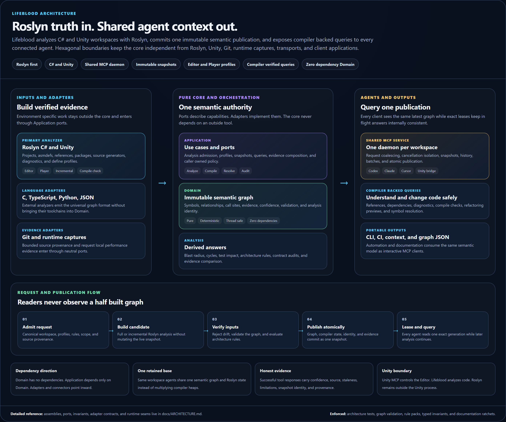

# Lifeblood

**Make C# and Unity codebases queryable by AI agents.**

Lifeblood is a Roslyn powered semantic analyzer and MCP server for C# and Unity.
It loads the real project, assembly, package, and define profile configuration,
builds a persistent graph of symbols and relationships, and gives agents
compiler verified answers instead of text search guesses.

Agents can ask what calls a method, what depends on a type, what may break after
a change, whether an edited file still compiles, which tests are affected, or
which architecture invariant owns a rule. Shared mode gives every agent in the
same workspace access to one current semantic and Roslyn base.

Lifeblood analyzes Unity code. It does not control the Unity Editor. Use it
alongside Unity MCP when an agent also needs to inspect or modify scenes,
GameObjects, and assets.

## Why Lifeblood

| | What it provides |
|---|---|
| **Compiler truth** | Roslyn resolves actual symbols, calls, references, types, diagnostics, and project boundaries. |
| **Unity awareness** | Editor and Player profiles, asmdef boundaries, package sources, MonoBehaviour messages, Unity attributes, and resolved UnityEvent targets. |
| **Shared agent context** | One workspace keyed daemon, one latest graph, immutable snapshots, and safe concurrent requests. |
| **Fast updates** | Full analysis builds the baseline. Incremental analysis refreshes affected modules after code or project changes. |
| **Evidence you can judge** | Responses report confidence, source, staleness, limitations, snapshot identity, and release provenance. |

Roslyn is the primary engine. A beta libclang adapter covers C, while TypeScript
and Python ship as standalone JSON emitting adapters. Any language can integrate
by producing the universal graph format. Live tool, port, invariant, test, and
self analysis counts are maintained in [`docs/STATUS.md`](docs/STATUS.md).

---

## Quick Start

### Install (30 seconds)

```bash
dotnet tool install --global Lifeblood
dotnet tool install --global Lifeblood.Server.Mcp
```

Requires [.NET 8 SDK](https://dotnet.microsoft.com/download/dotnet/8.0).

### Connect to Claude Code, Cursor, or any MCP client

Add to your project's `.mcp.json`:

```json
{
  "mcpServers": {
    "lifeblood": {
      "command": "lifeblood-mcp",
      "args": ["--shared"]
    }
  }
}
```

Shared mode gives same-workspace agents one latest semantic/Roslyn base. See the [MCP Setup Guide](docs/MCP_SETUP.md) for lifecycle details, Claude Desktop, VS Code, Cursor, raw stdio configs, and the private-process rollback form.

### Use

```
lifeblood_analyze projectPath="/path/to/your/project" defineProfiles=["Editor","Player"] → build the baseline
lifeblood_analyze projectPath="/path/to/your/project" incremental=true allowFullFallback=true defineProfiles=["Editor","Player"] → refresh after changes
lifeblood_analyze projectPath="/path" excludePaths=["Packages/*","*/Samples*/*"] → drop vendored/sample source before compilation
lifeblood_blast_radius symbolId="type:MyApp.AuthService" → what breaks if I change this?
lifeblood_file_impact filePath="src/AuthService.cs"      → what files are affected?
lifeblood_find_references symbolId="type:MyApp.IRepo"    → every caller, every consumer
lifeblood_search query="quantize timing to grid"         → ranked keyword + xmldoc search
lifeblood_invariant_check id="INV-CANONICAL-001"         → query architectural invariants
lifeblood_compile_check filePath="src/MyFile.cs"         → does this file still compile?
lifeblood_execute code="typeof(MyApp.Foo).GetMethods()"  → run C# against your types
```

After the first analysis, use `incremental: true` for fast re-analysis (seconds instead of minutes).

### CLI (for CI and scripting)

```bash
lifeblood analyze --project /path/to/your/project
lifeblood analyze --project /path/to/your/project --rules hexagonal
lifeblood context --project /path/to/your/project
lifeblood export  --project /path/to/your/project --out graph.json
lifeblood verify  --incremental --project /path/to/your/project
```

`export --out` writes the graph JSON to a file directly (preferred over shell redirection on Windows PowerShell, where `>` defaults to UTF-16-LE-with-BOM and breaks JSON re-import without the `INV-JSON-IMPORT-BOM-001` BOM-aware reader). `verify --incremental` runs full + incremental analyze in one process and asserts `summary.edges` are identical (`INV-INCREMENTAL-XREF-001`); non-zero exit on drift makes it CI-wireable.

### Build from source

```bash
git clone https://github.com/user-hash/Lifeblood.git
cd Lifeblood
dotnet build
dotnet test
```

---

## MCP Tools

```
Roslyn (C#)    ──┐                              ┌──  Execute code against project types
libclang (C)   ──┤  ┌────────────────────────┐  ├──  Diagnose / compile-check
TypeScript     ──┼→ │    Semantic Graph      │ →┤──  Find references / rename / format
Python         ──┤  │  (symbols / edges /    │  ├──  Blast radius / file impact
JSON graph     ──┤  │   evidence / trust)    │  └──  Context packs / architecture rules
  community    ──┘  └────────────────────────┘
  adapters
```

Connect an MCP client. Load a project. The AI agent gets the **MCP tool surface**: read side + write side (live counts in [`docs/STATUS.md`](docs/STATUS.md)). Representative groups are below; [`docs/TOOLS.md`](docs/TOOLS.md) owns the complete roster.

| | Tools |
|---|---|
| **Session and evidence** | Analyze, Capabilities, Batch, Snapshots, Evidence Drift, Performance Evidence, Context, Invariant Check |
| **Semantic graph** | Lookup, Dependencies, Dependants, Blast Radius, File Impact, Asmdef Check, Search, Dead Code, Authority Report, Cycles, Test Impact |
| **Compiler-backed** | Execute, Diagnose, Compile-check, Contract Audit, Enum Coverage, Static Tables, Assignment Coverage, Find References, Find Definition, Find Implementations, Rename, Format |

Every read-side tool that takes a `symbolId` routes through one resolver (canonical id, truncated method form, bare short name, kind correction, wrong-namespace fallback). Every read-side response carries a typed truth envelope: truth tier, confidence band, evidence source, staleness, per-tool limitations.

[Full tool reference](docs/TOOLS.md) · [What's new](CHANGELOG.md)

---

## Architecture

Hexagonal. Pure domain core with zero dependencies. Language adapters on the left, AI connectors on the right.

```
LEFT SIDE                     CORE                     RIGHT SIDE
(Language Adapters)        (The Pipe)               (AI Connectors)

Roslyn (C#)       ──┐                            ┌──  MCP Server (stdio)
libclang (C)      ──┤                            ├──  Context Pack Generator
TypeScript        ──┼→  Domain  →  Application  →┤──  Instruction File Generator
Python            ──┤       ↑                     ├──  CLI / CI
JSON graph        ──┘    Analysis (optional)      └
```

All port interfaces wired. Boundaries enforced by [architecture invariant tests](tests/Lifeblood.Tests/ArchitectureInvariantTests.cs), the [typed-invariant tree under `docs/invariants/`](docs/invariants/INDEX.md) (queryable via `lifeblood_invariant_check`), and [11 frozen ADRs](docs/ARCHITECTURE_DECISIONS.md). Live counts: [`docs/STATUS.md`](docs/STATUS.md).

Source-control provenance is a separate infrastructure boundary: one neutral
receipt and Application port are implemented by `Lifeblood.Adapters.Git` and
captured for analyze once at request admission and consumed by invariant evidence
plus release ratchets. Language adapters and MCP handlers do not launch Git or
own competing dirty-state models.



[Full architecture](docs/ARCHITECTURE.md) · [Interactive diagram](docs/architecture.html)

---

## Roslyn First, Extensible by Design

| Adapter | How it works | Confidence |
|---------|-------------|------------|
| **C# / Roslyn** | Compiler-grade semantic analysis. Cross-module resolution. Bidirectional: analysis plus code execution. | Proven |
| **C / libclang** | Beta (v0.7.7). Reads `compile_commands.json`, parses each translation unit through libclang, emits Lifeblood-shape `graph.json`. Surfaces translation units, functions, globals, fields, type shells, enum members, macros, includes, callback-table rows and cells. Partial-parse tolerant. | Beta / High on covered C fixtures |
| **TypeScript** | Standalone Node.js. `ts.createProgram` plus `TypeChecker`. | High |
| **Python** | Standalone `ast` module. Zero dependencies. | Structural |
| **Any language** | Output JSON conforming to `schemas/graph.schema.json`. | Varies |

[Adapter guide](docs/ADAPTERS.md) · [Native C capability](docs/NATIVE_CLANG.md)

---

## Unity

Lifeblood is a Roslyn analyzer for Unity projects. It reads Unity generated
project descriptors and asmdefs, analyzes Editor and Player profiles, resolves
cross assembly calls, and keeps package sources visible in the analysis receipt.

- `dead_code` understands MonoBehaviour messages, Unity reflection attributes,
  type reachability, and resolved UnityEvent calls from scene, prefab, and asset
  YAML.

- `compile_check filePath=...` checks a Unity source file inside its real owning
  assembly with the correct references and define profile.

- `execute` can load Unity assemblies from `Library/ScriptAssemblies/` for
  compiler backed inspection against project types.

- The Unity bridge exposes a curated set of Lifeblood tools inside the Editor,
  while the standalone `lifeblood-mcp` server exposes the complete tool surface.

Lifeblood runs as a sidecar alongside
[Unity MCP](https://github.com/CoplayDev/MCPForUnity), so no Roslyn assemblies
load into Unity and domain reloads do not destroy the shared semantic base.
Unity MCP controls scenes, GameObjects, assets, and the Editor. Lifeblood
explains the code and its relationships. Together they give agents both control
and compiler level understanding.

[Unity setup guide](docs/UNITY.md)

---

## Dogfooding

Self-analysis (symbols, edges, modules, types, violations, cycles), discovered test cases, `[SkippableFact]` opt-in count, typed-invariant audit (total + category coverage, duplicates, parse warnings) — every metric is anchored in [`docs/STATUS.md`](docs/STATUS.md) and ratcheted against the live source on every CI run (see [`tests/Lifeblood.Tests/DocsTests.cs`](tests/Lifeblood.Tests/DocsTests.cs)). Zero regressions, zero parse warnings.

Production-verified on large Unity workspaces; current dogfood counts and memory profiles live in [Status](docs/STATUS.md). Authority report classifies methods across the full surface and identifies forwarder candidates for any host-with-many-subordinates triage (partial-class hosts, dispatchers, facades, ports). Edge count grew +18% over the prior baseline because enum-member references the dangling-edge filter was silently dropping (R2-3) now resolve. 50+ real bugs surfaced through dogfooding — methodology and per-finding history are summarized in [Status](docs/STATUS.md) and the [CHANGELOG](CHANGELOG.md).

---

## Roadmap

- **Native Clang maturity**: move from focused-slice scout to whole-build coverage on FFmpeg-class C codebases (WSL + bear, MSYS2 + bear, or a project-specific compile-database generator). Tracked in [`docs/plans/native-clang-adapter-masterplan-2026-05-16.md`](docs/plans/native-clang-adapter-masterplan-2026-05-16.md).
- **C++ over libclang**: extend the native adapter past C to C++. Same boundary, additional Clang AST coverage (templates, classes, member functions).
- **Community adapters**: contribution guides for [Go](adapters/go/) and [Rust](adapters/rust/). Contract and checklist ready, no implementation code yet.
- **REST / LSP bridge**: expose the graph to IDE extensions and web services.

---

## Documentation

| Page | Description |
|------|-------------|
| [Tools](docs/TOOLS.md) | Every MCP tool — symbol ID format, incremental usage, dead_code caveats, file-mode compile_check, smart-dynamic context shaping |
| [MCP Setup](docs/MCP_SETUP.md) | Copy-paste configs for Claude Code, Cursor, VS Code, Claude Desktop, Unity |
| [Unity Integration](docs/UNITY.md) | Sidecar architecture, setup, Unity reachability + Editor reflection roster, file-mode compile_check |
| [Architecture](docs/ARCHITECTURE.md) | Hexagonal structure, dependency flow, port interfaces, invariant tree |
| [Architecture Decisions](docs/ARCHITECTURE_DECISIONS.md) | 11 frozen ADRs |
| [Invariants tree](docs/invariants/INDEX.md) | Typed architectural invariants, queryable via `lifeblood_invariant_check` |
| [Status](docs/STATUS.md) | Component table, test counts, self-analysis, production stats, memory profiles |
| [Adapters](docs/ADAPTERS.md) | How to build a language adapter (13-item checklist) |
| [Native C support](docs/NATIVE_CLANG.md) | libclang-based C extractor: scope, build, fixtures, FFmpeg scout, what works, what is deferred |
| [Release checklist](docs/RELEASE.md) | Eternal pre-tag gate: tests green, CHANGELOG link refs, doc anchors current, NuGet Trusted Publishing (OIDC) flow |
| [CHANGELOG](CHANGELOG.md) | Every release — additions, fixes, known limitations |

---

## Related

- [LivingDocFramework](https://github.com/user-hash/LivingDocFramework) — the methodology that shaped the architecture
- [Roslyn](https://github.com/dotnet/roslyn) — the C# compiler platform
- [Case study](https://github.com/user-hash/LivingDocFramework/blob/main/docs/CASE_STUDY.md) — the 400k LOC Unity project where these ideas were proven

---

## License

AGPL v3
